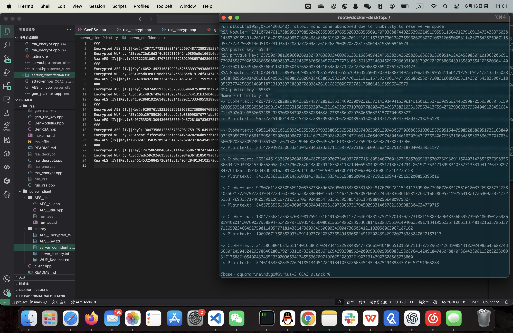
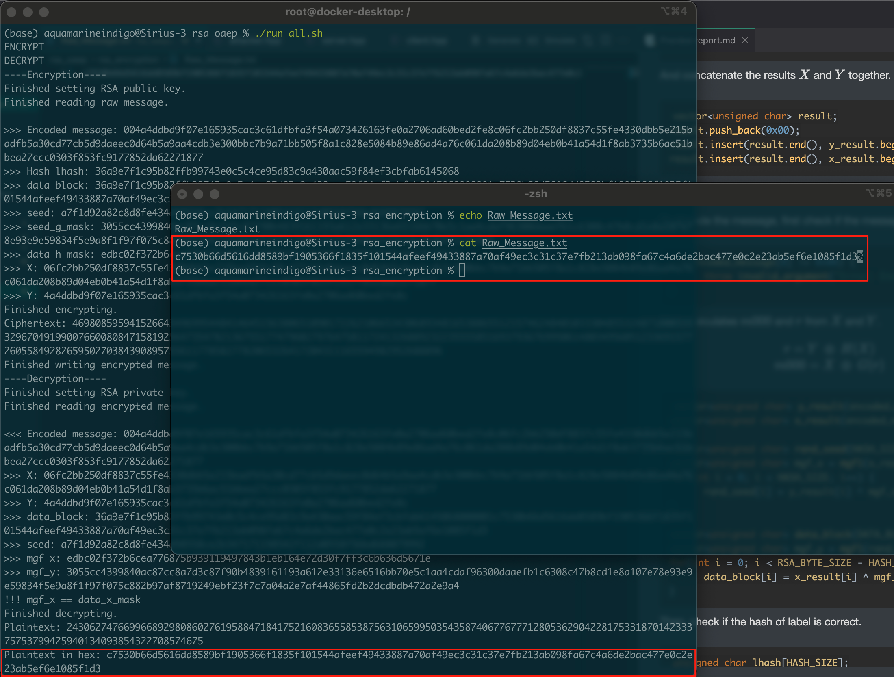

# Report of Network Security Project

## File format

List of main files in the project folder and their contents.
- project
  - README.md
  - .gitignore
  - report.pdf
  - rsa ---> **The code folder for task 1**
    - rsa_encryption
      - Encrypted_Message.txt
      - Raw_Message.txt
    - rsa_key
      - RSA_Moduler.txt
      - RSA_p.txt
      - RSA_q.txt
      - RSA_Private_Key.txt
      - RSA_Public_Key.txt
    - GenModulus.hpp
    - GenRSA.hpp ---> **The main header for RSA algorithm**
    - run_rsa.cpp
    - gen_rsa_key.cpp
    - gen_plaintext.cpp
    - rsa_encrypt.cpp
    - rsa_decrypt.cpp
    - make_run.sh
    - README.md
  - server_client ---> **The code folder for task 2, the server-client part**
    - AES_lib
      - AES_utils.hpp ---> **The main header for AES algorithm and other useful functions**
      - AES_cli.hpp
      - run_aes.sh
    - history ---> **The history folder of server-client communication**
      - AES_Encrypted_WUP.txt
      - AES_Key.txt
      - server_confidential.txt
      - server_history.txt ---> **The history of the server used for CCA2 Attack**
      - WUP_Request.txt
    - server.hpp
    - run_server.cpp
    - run_server.sh
    - client.hpp
    - run_client.cpp
    - run_client.sh
    - README.md
  - CCA2_attack ---> **The code folder for task 2, the CCA2 attack part**
    - attacker.hpp ---> **The main header for CCA2 attack, reads history in the server_client folder**
    - run_attack.cpp
    - run_attack.sh
  - rsa_oaep ---> **The code folder for task 3, RSA-OAEP algorithm**
    - rsa_encryption
      - Encrypted_Message.txt
      - Message_After_Padding.txt ---> **The message after OAEP padding**
      - Random_Number.txt ---> **The random number used for OAEP padding**
      - Raw_Message.txt
    - RSA_OAEP.hpp ---> **The main header for RSA-OAEP algorithm**
    - run_rsa_oaep.cpp
    - run_rsa.sh
    - gen_plaintext.cpp
    - rsa_encrypt.cpp
    - rsa_decrypt.cpp
    - run_all.sh ---> **Run this and can finish plaintext generation, RSA-OAEP encryption and decryption**
    - README.md

Note: The whole project uses C++17 with **GMP library** and **OpenSSL**. In each compilation command in ``.sh`` and ``makefile``, the GMP library and OpenSSL library paths are explicitly specified. When running shell ``.sh`` and ``makefile`` files, the library paths should be specified according to the actual environment, or be deleted from the compiling commands.

The project could also found in [https://github.com/Aquamarine-Indigo/RSA-Attack-OAEP.git](https://github.com/Aquamarine-Indigo/RSA-Attack-OAEP.git).

## Task 1: RSA Implementation

### Implementation Details

The RSA algorithm generates a modulus pair, and then generates the public and private keys based on the pair.

First generates the modulus pair $N = pq$, where $p$ and $q$ are two large prime numbers. Then $\phi(N) = (p-1)(q-1)$.
```cpp
gmp_randstate_t state;
gmp_randinit_mt(state);
gmp_randseed_ui(state, time(NULL));
// N = p * q
generate_large_prime(p, state, bits>>1);
generate_large_prime(q, state, bits>>1);
mpz_mul(keypair.N, p, q);
// phi(N) = (p-1)*(q-1)
mpz_sub_ui(p_1, p, 1);
mpz_sub_ui(q_1, q, 1);
mpz_mul(phi_N, p_1, q_1);
```

Then, choose $e = 65537$, which is a commonly-used public exponent, and calculate $d = e^{-1} \bmod \phi(N)$.
```cpp
mpz_set_ui(keypair.e, 65537);
if (mpz_invert(keypair.d, keypair.e, phi_N) == 0) {
    cerr << "Error computing modular inverse (e, phi)." << endl;
    return;
}
```

Finally, the public key is $(N, e)$, and the private key is $(N, d)$.

To encrypt a message $m$, calculate $c = m^e \bmod N$.
```cpp
void encrypt_RSA(mpz_t c, const mpz_t m, const RSAPublicKey& pubkey) {
	mpz_powm(c, m, pubkey.key, pubkey.N);
}
```

To decrypt a ciphertext $c$, calculate $m = c^d \bmod N$.
```cpp
void decrypt_RSA(mpz_t m, const mpz_t c, const RSAKeyPair& keypair) {
	mpz_powm(m, c, keypair.d, keypair.N);
}
```

### How to use

Run ``make_run.sh`` in task 1's folder 'rsa' to compile and run the program. You need to modify the GMP library path in ``makefile``, because the path set in it is for a MacOS system. 

You might need to first run ``make clean`` before running ``make_run.sh``.

1. Run ``gen_rsa_key`` to generate a RSA key pair.
2. Run ``gen_plaintext`` to generate a new plaintext.
3. Run ``rsa_encrypt`` to encrypt the plaintext with the public key.
4. Run ``rsa_decrypt`` to decrypt the ciphertext with the private key.

## Task 2: CCA2 Attack in Server-Client Communication

### Implementation Details

#### Server-Client WUP Protocol

The server-client communication protocol is a straightforward WUP request from the project requirement file.
1. Client generates a 128 bit AES key and IV pair for the session.
2. Client encrypts the AES key and IV pair with the generated RSA public key.
3. Client generates a WUP request and encrypts it with the AES key. 
   ```cpp
   string generate_wup_message() {
      string nonsense_str = "----------------";
      return nonsense_str + "WUP|" + get_local_ip() + "|" + getCurrentTime();
   }
   ```
4. Client sends the RSA-encrypted AES key+IV and AES-encrypted WUP request to the server.
5. Server receives the RSA-encrypted AES key+IV and AES-encrypted WUP request.
6. Server decrypts the RSA-encrypted AES key+IV with the RSA private key.
7. Server decrypts the AES-encrypted WUP request with the decrypted AES key and IV.
8. Check if the WUP request is valid.

The server records history of the WUP requests, giving the attack enough to analyze: Encrypted AES key+IV ciphertext. The attacker can perform CCA2 attack on the server to decrypt the WUP request. The history is in ``server_history.txt``.

#### AES Encryption and Decryption ``AES_utils.hpp``

The standard OpenSSL AES encryption and decryption functions are used to encrypt and decrypt the WUP request and the AES key+IV pair. The AES key and IV are generated randomly for each session, and use C++ type ``vector<unsigned char>``. The conversion functions between ``vector<unsigned char>`` and ``mpz_t`` are implemented also in the ``AES_utils.hpp`` header.

```cpp
class AES_utils {
public:
	...
	static vector<unsigned char> encrypt(const vector<unsigned char>& plaintext, 
			const vector<unsigned char>& key, vector<unsigned char>& iv) {
		EVP_CIPHER_CTX* ctx = EVP_CIPHER_CTX_new();
		vector<unsigned char> ciphertext(plaintext.size() + KEY_SIZE);
		int len, ciphertext_len;
		
		iv.resize(KEY_SIZE);
		if (!RAND_bytes(iv.data(), KEY_SIZE))
			throw std::runtime_error("IV generation fail");
		
		EVP_EncryptInit_ex(ctx, EVP_aes_128_cbc(), NULL, key.data(), iv.data());
		EVP_EncryptUpdate(ctx, ciphertext.data(), &len, plaintext.data(), plaintext.size());
		ciphertext_len = len;
		
		EVP_EncryptFinal_ex(ctx, ciphertext.data() + len, &len);
		ciphertext_len += len;
		EVP_CIPHER_CTX_free(ctx);
		
		ciphertext.resize(ciphertext_len);
		return ciphertext;
	}

	static vector<unsigned char> decrypt(const vector<unsigned char>& ciphertext,
			const vector<unsigned char>& key, const vector<unsigned char>& iv) {
		EVP_CIPHER_CTX* ctx = EVP_CIPHER_CTX_new();
		vector<unsigned char> plaintext(ciphertext.size());
		int len, plaintext_len;

		EVP_DecryptInit_ex(ctx, EVP_aes_128_cbc(), NULL, key.data(), iv.data());
		EVP_DecryptUpdate(ctx, plaintext.data(), &len, ciphertext.data(), ciphertext.size());
		plaintext_len = len;

		EVP_DecryptFinal_ex(ctx, plaintext.data() + len, &len);
		plaintext_len += len;
		EVP_CIPHER_CTX_free(ctx);

		plaintext.resize(plaintext_len);
		return plaintext;
	}
	...
};
```

#### Adaptive Chosen-Ciphertext Attack (CCA2)

CCA2 attack is a type of attack that, the attacker can choose any ciphertext besides the target ciphertext, and ask for the decryption oracle to decrypt it when attack. The attacker can use only the encryption and decryption oracle, but doesn't know the private key. RSA algorithm is vulnerable to CCA2 attack.

In folder ``CCA2_attack``, ``attacker.hpp`` performs the whole CCA2 attack.

First, reads the ciphertext $c_1$, which is the target ciphertext, and cannot be ask for decryption due to the CCA2 security assumption. Reads the public key $(N, e)$. $m_1$ is the plaintext of the target ciphertext $c_1$.

Next, set a chosen plaintext $m_2$. I set the plaintext $m_2 = 2$, obtained the modular inverse ${m_2}^{-1} = 2^{-1} \bmod N$, and the ciphertext $c_2 = E(m_2, (N, d)) = {m_2}^e \bmod N$.
```cpp
// chosen_cipher: m2, cc_cipher: c2, cc_inverse: m2^{-1}
mpz_t chosen_cipher, cc_inverse, cc_cipher;
mpz_inits(chosen_cipher, cc_inverse, cc_cipher, NULL);
mpz_set_ui(chosen_cipher, 2);
mpz_invert(cc_inverse, chosen_cipher, rsa_key.N);
encrypt_RSA(cc_cipher, chosen_cipher, pubkey);
```

Then, calculate a new ciphertext $c' = c_1 \cdot c_2$, and ask the oracle for decryption $m'$: $$\begin{aligned}m' &= D_{oracle}(c') \\&= {c'}^d \bmod N \\&= {(c_1 \cdot c_2)}^d \bmod N \\&= {({m_1}^e \cdot {m_2}^e)}^d \bmod N \\&= (m_1 \cdot m_2)^{ed} \bmod N = m_1 \cdot m_2 \bmod N.\end{aligned}$$
```cpp
mpz_t cc_mul, cc_mul_decrypt;
mpz_inits(cc_mul, cc_mul_decrypt, NULL);
mpz_mul(cc_mul, target, cc_cipher);
decrypt_RSA(cc_mul_decrypt, cc_mul, rsa_key);
```

Thus, $m_1 = m' \cdot {m_2}^{-1} \bmod N$, which is the plaintext of the target ciphertext $c_1$.
```cpp
mpz_mul(result, cc_mul_decrypt, cc_inverse);
mpz_mod(result, result, rsa_key.N);
```

### How to Use

To generate server-client communication history, run ``server_client/run_server.sh``, and then run ``server_client/run_client.sh`` in another command line window. You can press enter or write anything in the client program. Whatever you input, once you press enter, a new WUP request along with AES key and IV will be sent to the server. You can press several times to obtain some history.

To perform the attack, run ``CCA2_attack/run_attacker.sh``. The program will use the public key in the ``rsa/rsa_key`` folder, and outputs the plaintext of the target ciphertext.

You need to modify the GMP library and OpenSSL path in ``.sh`` files, because the path set in it is for a MacOS system. 

The figure shows an example of the attack. For several history records, the attacker analyzes all of them and obtains all the plaintexts of the target ciphertexts.


## Task 3: RSA-OAEP Implementation

### Implementation Details

A **mask generation function** is needed for OAEP, which hashes the message to a new length. The hash function used is SHA256.
```cpp
vector<unsigned char> mgf1(const vector<unsigned char> &seed, size_t maskLen) {
	vector<unsigned char> mask;
	unsigned char counter[4] = {0, 0, 0, 0};
	for (size_t i = 0; mask.size() < maskLen; ++i) {
		counter[3] = i & 0xFF;
		counter[2] = (i >> 8) & 0xFF;
		counter[1] = (i >> 16) & 0xFF;
		counter[0] = (i >> 24) & 0xFF;
		vector<unsigned char> data(seed);
		data.insert(data.end(), counter, counter + 4);
		unsigned char hash[HASH_SIZE];
		SHA256(data.data(), data.size(), hash);
		mask.insert(mask.end(), hash, hash + HASH_SIZE);
	}
	mask.resize(maskLen);
	return mask;
}
```

#### Encode Message

To encode a message, pad the message with hashed label, ``0x00`` for padding-length times, and ``0x01``. The padded message has size ``MAX_MESSAGE_SIZE``, denote as $m000$.
```cpp
const string lhash_label = " ";
...
unsigned char lhash[HASH_SIZE];
SHA256((const unsigned char *)lhash_label.data(), lhash_label.size(), lhash);
// format: PS*0x00 || 0x01 || M
int ps_len = MAX_MESSAGE_SIZE - message.size();
vector<unsigned char> data_block(lhash, lhash + HASH_SIZE);
data_block.insert(data_block.end(), ps_len, 0x00);
data_block.insert(data_block.end(), 0x01);
data_block.insert(data_block.end(), message.begin(), message.end());
```

Then, encode the padded message and a random seed with the mask generation function. $$X = m000 \space \oplus \space G(r) \\ Y = r \space \oplus \space H(m000)$$
```cpp
// X = m000 XOR MGF1(seed, n-k0)
vector<unsigned char> seed_g_mask = mgf1(rand_seed, DATA_BLOCK_LEN);
vector<unsigned char> x_result(DATA_BLOCK_LEN);
for(int i = 0; i < RSA_BYTE_SIZE - HASH_SIZE - 1; i++) {
   x_result[i] = data_block[i] ^ seed_g_mask[i];
}
// Y = seed XOR MGF1(X, k0)
vector<unsigned char> data_h_mask = mgf1(x_result, HASH_SIZE);
vector<unsigned char> y_result(HASH_SIZE);
for(int i = 0; i < HASH_SIZE; i++) {
   y_result[i] = data_h_mask[i] ^ rand_seed[i];
}
```

And concatenate the results $X$ and $Y$ together.
```cpp
vector<unsigned char> result;
result.push_back(0x00);
result.insert(result.end(), y_result.begin(), y_result.end());
result.insert(result.end(), x_result.begin(), x_result.end());
```

#### Decode Message

To decode the message, first check if the message starts with ``0x00``.
```cpp
if(encoded_message[0] != 0x00) {
      throw invalid_argument("Error: Encoded message does not start with 0x00");
}
```

Next, calculates $m000$ and $r$ from $X$ and $Y$. $$r = Y \space \oplus \space H(X) \\ m000 = X \space \oplus \space G(r)$$
```cpp
vector<unsigned char> y_result(encoded_message.begin() + 1, encoded_message.begin() + 1 + HASH_SIZE);
vector<unsigned char> x_result(encoded_message.begin() + 1 + HASH_SIZE, encoded_message.end());

vector<unsigned char> rand_seed(HASH_SIZE);
vector<unsigned char> mgf_x = mgf1(x_result, HASH_SIZE);
for(int i = 0; i < HASH_SIZE; i++) {
      rand_seed[i] = y_result[i] ^ mgf_x[i];
}

vector<unsigned char> data_block(DATA_BLOCK_LEN);
vector<unsigned char> mgf_y = mgf1(rand_seed, DATA_BLOCK_LEN);
for(int i = 0; i < RSA_BYTE_SIZE - HASH_SIZE; i++) {
      data_block[i] = x_result[i] ^ mgf_y[i];
}
```

Then, check if the hash of label is correct.
```cpp
unsigned char lhash[HASH_SIZE];
SHA256((const unsigned char*)lhash_label.data(), lhash_label.size(), lhash);

if (std::equal(data_block.begin(), data_block.begin() + HASH_SIZE, lhash) == false) {
      cout << ">>> Hash mismatched: found    " << vec2hex(vector<unsigned char>(data_block.begin(), data_block.begin() + HASH_SIZE)) << endl;
      cout << ">>> Hash mismatched: expected " << vec2hex(vector<unsigned char>(lhash, lhash + HASH_SIZE)) << endl;
      throw std::runtime_error("Error: Hash mismatched.");
}
```

Finally, check if the last byte is 0x01. If so, return the rest of the data block.
```cpp
vector<unsigned char>::iterator it = std::find(data_block.begin() + HASH_SIZE, data_block.end(), 0x01);
if (it == data_block.end())
      throw std::runtime_error("Error: No 0x01 found in encoded message.");
return vector<unsigned char>(it + 1, data_block.end());
```

#### Encryption and Decryption

Encryption: encode the message using OAEP, then encrypt the encoded message using RSA.
```cpp
void encrypt_RSA(mpz_t &c, const mpz_t &m, const RSAPublicKey& pk, bool save_seed=false) {
	vector<unsigned char> message_vec = mpz2vec(m);
	vector<unsigned char> rand_seed(HASH_SIZE);
	vector<unsigned char> oaep_message = encoding_OAEP(message_vec, rand_seed);
	mpz_t oaep_message_mpz;
	mpz_init(oaep_message_mpz);
	vec2mpz(oaep_message_mpz, oaep_message);
	mpz_powm(c, oaep_message_mpz, pk.key, pk.N);

	if(save_seed == true) {
		ofstream outfile;
		outfile.open("rsa_encryption/Random_Number.txt");
		outfile << vec2hex(rand_seed);
		outfile.close();

		outfile.open("rsa_encryption/Message_After_Padding.txt");
		outfile << vec2hex(oaep_message);
		outfile.close();
	}
}
```

Decryption: decrypt the message using RSA, then decode the decrypted message using OAEP.
```cpp
void decrypt_RSA(mpz_t &m, const mpz_t &c, const RSAPrivateKey& sk) {
	mpz_t oaep_message_mpz;
	mpz_init(oaep_message_mpz);
	mpz_powm(oaep_message_mpz, c, sk.key, sk.N);
	vector<unsigned char> oaep_message = mpz2vec_len(oaep_message_mpz, RSA_BYTE_SIZE);
	vector<unsigned char> message_vec = decoding_OAEP(oaep_message);
	vec2mpz(m, message_vec);
}
```

### How to Use

Run ``run_all.sh``, and the shell will run all the procedure: generate plaintext, encryption and decryption. This shell uses RSA keys in folder ``rsa/rsa_key``.

You need to modify the GMP library and OpenSSL path in ``run_all.sh``, because the path set in it is for a MacOS system. 

A successful run:
